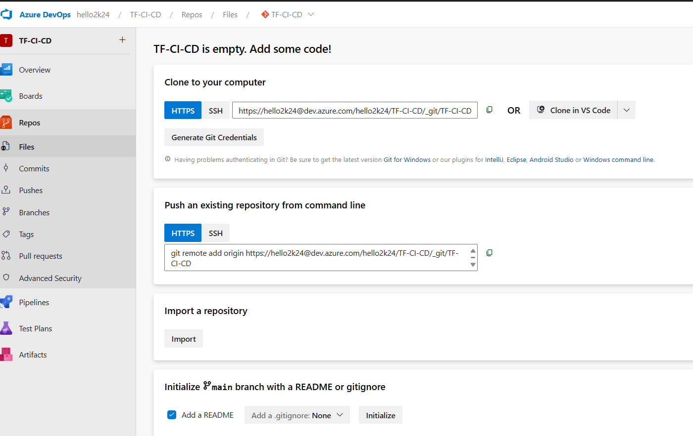
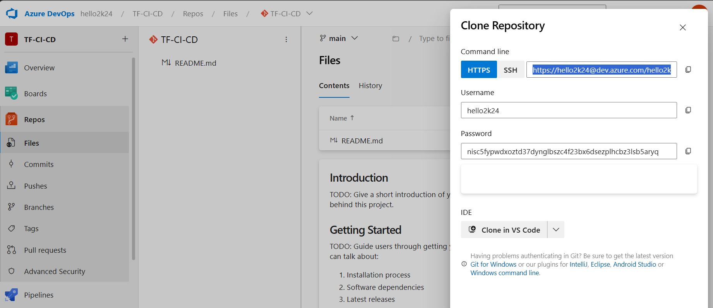

---
lab:
    title: 'Practicing Terraform Version Control'
    module: 'Module 3: Git and Azure Repo'
---

## Task:
1. **Create Azure Repo**
2. **Push Terraform Code to Azure Repo**
3. **Add Git hook**
4. **Push new Terraform code to v1 Branch in Azure Repo**
5. **Create Azure Repo Branch Policy**

### Lab requirements

- This lab requires **Microsoft Edge** or an [Azure DevOps supported browser.](https://docs.microsoft.com/azure/devops/server/compatibility)

- **Set up an Azure DevOps organization:** If you don't already have an Azure DevOps organization that you can use for this lab, create one by following the instructions available at [Create an organization or project collection](https://docs.microsoft.com/azure/devops/organizations/accounts/create-organization).

- If you don't have Git 2.29.2 or later installed yet, start a web browser, navigate to the [Git for Windows download page](https://gitforwindows.org/) download it, and install it.
- If you don't have Visual Studio Code installed yet, from the web browser window, navigate to the [Visual Studio Code download page](https://code.visualstudio.com/), download it, and install it.
- If you don't have Visual Studio Terraform extension installed yet, in the web browser window, navigate to the [Terraform extension installation page](https://marketplace.visualstudio.com/items?itemName=HashiCorp.terraform) and install it.

## Instructions:
## 1. **Create Azure Repo**
1. In your `Azure-DevOps-Terraform-Labs` Project Click **Repo**
 

2. Click on Last Option which says `initialise`
> This creates an empty Repo in your Project, where you can push your code 
3. On Top Right corner => Click `Clone` => nOw click on `generate credentials`



> copy and store them for Future Reference

4. Make sure you are in the same folder where you have you terraform Code to Push (the one whihc was created in the previous lab) ==> Now Open Terminal in your VS Code and run the following commands:

```sh
git config --global user.name "YOUR COPIED USERNAME HERE"
git config --global user.email "THE EMAIL USED FOR SIGN IN TO AZURE DEVOPS"
```
5. To Push the local Code to Azure Repo Run:

```sh
git add .
git commit -m "Pushing to Azure Repo"
git push 
```

6. Now when prompted, provide the copied password 

## 3. **Add Git hook**
1. Navigate to `.git` directory

```
cd .git/hooks
```

2. Rename `pre-commit.sample` to `pre-commit` and copy paste below code :
```sh
echo " " 
echo "******* This is Pre-commit Hook ********"
```

3. Verify

## **Push new Terraform code to v1 Branch in Azure Repo**