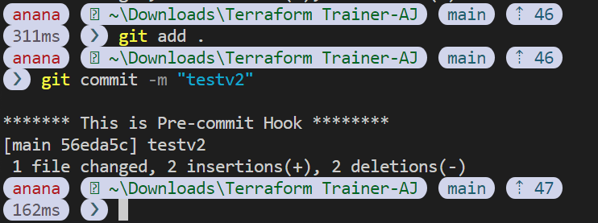
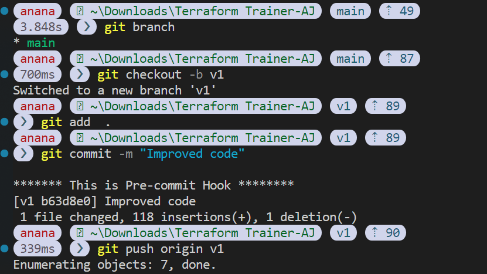

---
lab:
    title: 'Practicing Terraform Version Control'
    module: 'Module 3: Git and Azure Repo'
---

## Task:
1. **Create Azure Repo**
2. **Push Terraform Code to Azure Repo**
3. **Add Git hook**
4. **Push new file to v1 Branch in Azure Repo**
5. **Create Azure Repo Branch Policy**

### Lab requirements

- This lab requires **Microsoft Edge** or an [Azure DevOps supported browser.](https://docs.microsoft.com/azure/devops/server/compatibility)

- **Set up an Azure DevOps organization:** If you don't already have an Azure DevOps organization that you can use for this lab, create one by following the instructions available at [Create an organization or project collection](https://docs.microsoft.com/azure/devops/organizations/accounts/create-organization).

- If you don't have Git 2.29.2 or later installed yet, start a web browser, navigate to the [Git for Windows download page](https://gitforwindows.org/) download it, and install it.
- If you don't have Visual Studio Code installed yet, from the web browser window, navigate to the [Visual Studio Code download page](https://code.visualstudio.com/), download it, and install it.
- If you don't have Visual Studio Terraform extension installed yet, in the web browser window, navigate to the [Terraform extension installation page](https://marketplace.visualstudio.com/items?itemName=HashiCorp.terraform) and install it.

## Instructions:
## 1. **Create Azure Repo** & ## 2. **Push Terraform Code to Azure Repo**
 
1. In your `Azure-DevOps-Terraform-Labs` Project Click **Repo**
 

2. Click on Last Option which says `initialise`
> This creates an empty Repo in your Project, where you can push your code 
3. On Top Right corner => Click `Clone` => nOw click on `generate credentials`


> copy and store them for Future Reference

4. Make sure you are in the same folder where you have you terraform Code to Push (the one whihc was created in the previous lab) ==> Now Open Terminal in your VS Code and run the following commands:

```sh
git config --global user.name "YOUR COPIED USERNAME HERE"
git config --global user.email "THE EMAIL USED FOR SIGN IN TO AZURE DEVOPS"
```
5. Create `main.tf` file with this [code](../Codes/1-create_rg.tf):

6. To Push the local Code to Azure Repo Run:

```sh
git add .
git commit -m "Pushing to Azure Repo"
git push 
```

7. Now when prompted, provide the copied password 

## 3. **Add Git hook**
1. Navigate to `.git` directory

```
cd .git/hooks
```

2. Rename `pre-commit.sample` to `pre-commit` and copy paste below code :
```sh
#!/bin/sh
echo " " 
echo "******* This is Pre-commit Hook ********"
```

3. Verify results by running 
```
git add .
git commit -m "testv2"
```




## 4. **Push new Terraform code to v1 Branch in Azure Repo**
1. Create new branch
```sh
git checkout -b v1
```
2. create a `readme.md` file
```md
# this is demo
```
3. now commit new branch
```sh
git add .
git commit -m "new branch"
git push origin v1
```


4. verify the results in Azure Repo

## 5. **Create Azure Repo Branch Policy**
Branch Policies

In this task, you will use the Azure DevOps portal to add policies to the main branch and only allow changes using Pull Requests that comply with the defined policies. You want to ensure that changes in a branch are reviewed before they are merged.

For simplicity we will work directly on the web browser repo editor (working directly in origin), instead of using the local clone in VS code (recommended for real scenarios).

1. Switch to the web browser displaying the **Mine** tab of the **Branches** pane in the Azure DevOps portal.
2. On the **Mine** tab of the **Branches** pane, hover the mouse pointer over the **main** branch entry to reveal the ellipsis symbol on the right side.
3. Click the ellipsis and, in the pop-up menu, select **Branch Policies**.

    

4. On the **main** tab of the repository settings, enable the option for **Require minimum number of reviewers**. Add **1** reviewer and check the box **Allow requestors to approve their own changes**(as you are the only user in your project for the lab)
5. On the **main** tab of the repository settings, enable the option for **Check for linked work items** and leave it with **Required** option.

    

#### Task 5: Testing branch policy

In this task, you will use the Azure DevOps portal to test the policy and create your first Pull Request.

1. In the vertical navigational pane of the of the Azure DevOps portal, in the **Repos>Files**, make sure the **main** branch is selected (dropdown above shown content).
2. To make sure policies are working, try making a change and committing it on the **main** branch, navigate to the **main.tf** file and select it. This will automatically display its content in the details pane.
3. On the first line add the following comment:

    ```tf
    # Testing main branch policy
    ```

4. Click on **Commit > Commit**. You will see a warning: changes to the main branch can only be done using a Pull Request.

    

5. Click on **Cancel** to skip the commit.

#### Task 6: Working with Pull Requests

In this task, you will use the Azure DevOps portal to create a Pull Request, using the **dev** branch to merge a change into the protected **main** branch. An Azure DevOps work item with be linked to the changes to be able to trace pending work with code activity.

1. In the vertical navigational pane of the of the Azure DevOps portal, in the **Boards** section, select **Work Items**.
2. Click on **+ New Work Item > Product Backlog Item**. In title field, write **Testing my first PR** and click on **Save**.
3. Now go back to the vertical navigational pane of the of the Azure DevOps portal, in the **Repos>Files**, make sure the **dev** branch is selected.
4. Navigate to the **main.tf** file and make the following change on the first line:

    ```tf
   # Testing my first PR
    ```

5. Click on **Commit > Commit** (leave default commit message). This time the commit works, **dev** branch has no policies.
6. A message will pop-up, proposing to create a Pull Request (as you **dev** branch is now ahead in changes, compared to **main**). Click on **Create a Pull Request**.

    

7. In the **New pull request** tab, leave defaults and click on **Create**.
8. The Pull Request will show some failed/pending requirements, based on the policies applied to our target **main** branch.
    - Proposed changes should have a work item linked
    - At least 1 user should review and approve the changes.

9. On the right side options, click on the **+** button next to **Work Items**. Link the previously created work item to the Pull Request by clicking on it. You will see one of the requirements changes  status.

    

10. Next,  open the **Files** tab to review the proposed changes. In a more complete Pull Request,  you would be able to review files one by one (marked as reviewed) and open comments for lines that may not be clear (hovering the mouse over the line number gives you an option to post a comment).
11. Go back to the **Overview** tab, and on the top-right click on **Approve**. All the requirements will change to green. Now you can click on **Complete**.
12. On the **Complete Pull Request** tab, multiple options will be given before completing the merge:
    - **Merge Type**: 4 merge types are offered, you can review them [here](https://learn.microsoft.com/azure/devops/repos/git/complete-pull-requests?view=azure-devops&tabs=browser#complete-a-pull-request) or observing the given animations. Choose **Merge (no fast forward)**.
    - **Post-complete options**:
        - Check **Complete associated work item...**. It will move associated PBI to **Done** state.

13. Click on **Complete Merge**

#### Task 7: Applying tags

The product team has decided that the current version of the site should be released as v1.1.0-beta.

1. In the vertical navigational pane of the of the Azure DevOps portal, in the **Repos** section, select **Tags**.
2. In the **Tags** pane, click **New tag**.
3. In the **Create a tag** panel, in the **Name** text box, type **v1.1.0-beta**, in the **Based on** drop-down list leave the **main** entry selected, in the **Description** text box, type **Beta release v1.1.0** and click **Create**.

    > **Note**: You have now tagged the repository at this release (the latest commit gets linked to the tag). You could tag commits for a variety of reasons and Azure DevOps offers the flexibility to edit and delete them, as well as manage their permissions.

### Exercise 5: Remove Branch Policies

When going through the different course labs in the order they are presented, the branch policy configured during this lab will block exercises in future labs. Therefore, we want you to remove the configured branch policies.

1. From the Azure DevOps **Azure-DevOps-Terraform-Labs** Project view, navigate to **Repos** and select **Branches**. Select the **Mine** tab of the **Branches** pane.
2. On the **Mine** tab of the **Branches** pane, hover the mouse pointer over the **main** branch entry to reveal the ellipsis symbol (the ...) on the right side.
3. Click the ellipsis and, in the pop-up menu, select **Branch Policies**.

    

4. On the **main** tab of the repository settings, disable the option for **Require minimum number of reviewers**.
5. On the **main** tab of the repository settings, disable the option for **Check for linked work items**.

    

6. You have now disabled/removed the branch policies for the main branch.
    

## Review

In this lab, you used the Azure DevOps portal to manage branches and repositories.