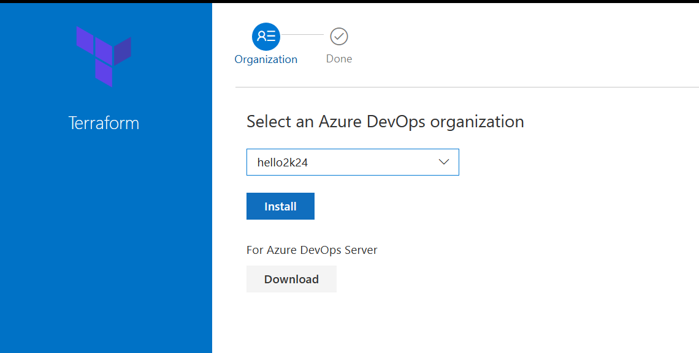
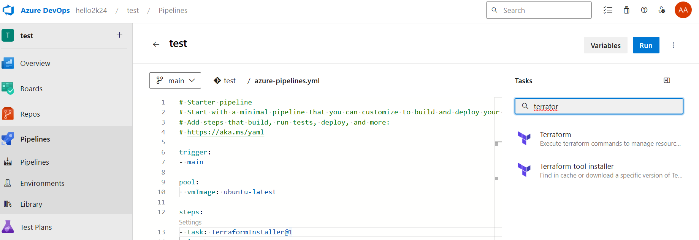

---
lab:
    title: 'Configuring Agent Pools and Understanding Pipeline Styles'
    module: 'Module 5: Azure Pipeline Basics'
---

## Tasks:

## 1. Create PAT and Install DevOps Agent
1. Within the Lab Virtual machine (Lab VM) or your own computer, start a web browser, navigate to [the Azure DevOps portal](https://dev.azure.com) and sign in by using the Microsoft account associated with your Azure DevOps organization.

  > **Note**: The Lab Virtual machine should have all necessary prerequisite software installed. If you are installing on your own computer, you will need to install .NET 7.0.x SDKs or higher necessary to build the demo project. See [Download Terraform](https://dotnet.microsoft.com/download/dotnet).

1. In the Azure DevOps portal, in the upper right corner of the Azure DevOps page, click the **User settings** icon, depending on whether or not you have preview features turned on, you should either see a **Security** or **Personal access tokens** item in the menu, if you see **Security**, click on that, then select **Personal access tokens**. On the **Personal Access Tokens** pane, and click **+ New Token**.
2. On the **Create a new personal access token** pane, click the **Show all scopes** link and, specify the following settings and click **Create** (leave all others with their default values):

    | Setting | Value |
    | --- | --- |
    | Name | **Azure-DevOps-Terraform-Labs** |
    | Scope (custom defined) | **Agent Pools** (show more scopes option below if needed)|
    | Permissions | **Read and manage** |

3. On the **Success** pane, copy the value of the personal access token to Clipboard.

    > **Note**: Make sure you copy the token. You will not be able to retrieve it once you close this pane.

4. On the **Success** pane, click **Close**.
5. On the **Personal Access Token** pane of the Azure DevOps portal, click **Azure DevOps** symbol in the upper left corner and then click **Organization settings** label in the lower left corner.
6. To the left side of the **Overview** pane, in the vertical menu, in the **Pipelines** section, click **Agent pools**.
7. On the **Agent pools** pane, in the upper right corner, click **Add pool**.
8. On the **Add agent pool** pane, in the **Pool type** dropdown list, select **Self-hosted**, in the **Name** text box, type **labs** and then click **Create**.
9.  Back on the **Agent pools** pane, click the entry representing the newly created **labs**.
10. On the **Jobs** tab of the **labs** pane, click the **New agent** button.
11. On the **Get the agent** pane, ensure that the **Windows** and **x64** tabs are selected, and click **Download** to download the zip archive containing the agent binaries to download it into the local **Downloads** folder within your user profile.

    > **Note**: If you receive an error message at this point indicating that the current system settings prevent you from downloading the file, in the Browser window, in the upper right corner, click the gearwheel symbol designating the **Settings** menu header, in the dropdown menu, select **Internet Options**, in the **Internet Options** dialog box, click **Advanced**, on the **Advanced** tab, click **Reset**, in the **Reset Browser Settings** dialog box, click **Reset** again, click **Close**, and try the download again.

12. Start Windows PowerShell as administrator and in the **Administrator: Windows PowerShell** console run the following lines to create the **C:\\agent** directory and extract the content of the downloaded archive into it.

    ```powershell
    cd \
    mkdir agent ; cd agent
    $TARGET = Get-ChildItem "$Home\Downloads\vsts-agent-win-x64-*.zip"
    Add-Type -AssemblyName System.IO.Compression.FileSystem
    [System.IO.Compression.ZipFile]::ExtractToDirectory($TARGET, "$PWD")
    ```

14. In the same **Administrator: Windows PowerShell** console, run the following to configure the agent:

    ```powershell
    .\config.cmd
    ```

15. When prompted, specify the values of the following settings:

    | Setting | Value |
    | ------- | ----- |
    | Enter server URL | the URL of your Azure DevOps organization, in the format **<https://dev.azure.com/>`<organization_name>`**, where `<organization_name>` represents the name of your Azure DevOps organization |
    | Enter authentication type (press enter for PAT) | **Enter** |
    | Enter personal access token | The access token you recorded earlier in this task |
    | Enter agent pool (press enter for default) | **labs** |
    | Enter agent name | **Azure-DevOps-Terraform-Labs** |
    | Enter work folder (press enter for _work) | **Enter** |
    | **(Only if shown)** Enter Perform an unzip for tasks for each step. (press enter for N) | **WARNING**: only press **Enter** if the message is shown|
    | Enter run agent as service? (Y/N) (press enter for N) | **Y** |
    | enter enable SERVICE_SID_TYPE_UNRESTRICTED (Y/N) (press enter for N) | **Y** |
    | Enter User account to use for the service (press enter for NT AUTHORITY\NETWORK SERVICE) | **Enter** |
    | Enter whether to prevent service starting immediately after configuration is finished? (Y/N) (press enter for N) | **Enter** |

    > **Note**: You can run self-hosted agent as either a service or an interactive process. You might want to start with the interactive mode, since this simplifies verifying agent functionality. For production use, you should consider either running the agent as a service or as an interactive process with auto-logon enabled, since both persist their running state and ensure that the agent starts automatically if the operating system is restarted.

16. Switch to the browser window displaying the Azure DevOps portal and close the **Get the agent** pane.
17. Back on the **Agents** tab of the **labs** pane, note that the newly configured agent is listed with the **Online** status.


23. On the **Azure-DevOps-Terraform-Labs** edit pane, in the upper right corner of the pane, click **Save and Run**. This will automatically trigger the build based on this pipeline.
24. In the Azure DevOps portal, in the vertical navigational pane on the left side, in the **Pipelines** section, click **Pipelines**. Depending on your lab setup, the pipeline might prompt you for permissions. Click **Permit** to allow the pipeline to run. 
25. On the **Recent** tab of the **Pipelines** pane, click the **Azure-DevOps-Terraform-Labs** entry, on the **Runs** tab of the **Azure-DevOps-Terraform-Labs** pane, select the most recent run, on the **Summary** pane of the run, scroll down to the bottom, in the **Jobs** section, click **Phase 1** and monitor the job until its successful completion.

## 2. Install Terraform Extention in Azure DevOps 
1. Open Extentions:


2. TF [Extention](https://marketplace.visualstudio.com/items?itemName=ms-devlabs.custom-terraform-tasks)


3. Get it free



## 3. Run YAML Pipeline using your agent

4. In the web browser window displaying the Azure DevOps portal, in the upper left corner, click the **Azure DevOps** label.
5. From the list of projects, click the tile representing your **Azure-DevOps-Terraform-Labs** project.
6. On the **Azure-DevOps-Terraform-Labs** pane, in the vertical navigational pane on the left side, in the **Pipelines** section, click **Pipelines**.

7. Check if visible in Pipeline



21. On the **Recent** tab of the **Pipelines** pane, select **Azure-DevOps-Terraform-Labs** and, on the **Azure-DevOps-Terraform-Labs** pane, select **Edit**.

[Pipeline Yaml code here](../Codes/Pipelines/az-tf-extention.yml)

22. On the **Azure-DevOps-Terraform-Labs** edit pane, in the existing YAML-based pipeline, replace line 13 which says  `vmImage: windows-latest` designating the target agent pool the following content, designating the newly created self-hosted agent pool:

    ```yaml
    name: labs
    demands:
    - Agent.Name -equals Azure-DevOps-Terraform-Labs
    ```

    > **WARNING**: Be careful with copy/paste, make sure you have same indentation shown above.

    