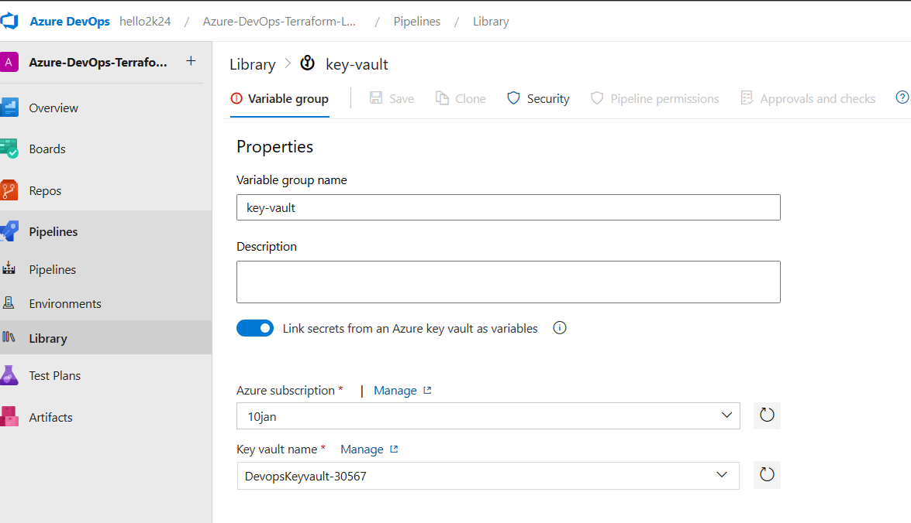

---
lab:
    title: 'Terraform authentication using Key Vault'
    module: 'Module 7: Variables in Azure Pipelines'
---

## Tasks:

## Pre-requisite
1. create storage account
```sh
az group create --name "az-devops-RG" --location "centralindia"
STR=backend$RANDOM
az storage account create -n $STR -g az-devops-RG -l centralindia --sku Standard_LRS
az storage container-rm create --storage-account $STR --name terraform
```

## 1. Create Service Principal in Azure
1. Open terminal of local computer, run the below command:
```sh
az ad sp create-for-rbac -n az-devops-key-vault --role Contributor --scopes /subscriptions/YOUR-SUBSCRIPTION-ID-HERE
``` 


2. Copy and Save the output in NOtepad .. You will need it

3. **Add service connection in azure devops project**

4. Go to Project settings => Left Side under Pipelines => Service COnnection


5. Click on Create => Choose `Azure Resource Manager` Option

6. Choose `service principal (manual)`


7. Enter your details and verify 


## 2. Create Key Vault in Azure
1. create it via cli
```sh
az keyvault create --location centralindia --name DevopsKeyvault-$RANDOM -g az-devops-RG
```
2. In the [Azure portal](https://portal.azure.com), navigate to the Key Vault resource. 

3.	Select **Access policies**, then select **Create**:

	

4.	Select the permissions **GET** & **LIST** under  **Secret permissions**
	

5. Under the **Principal** selection pane, enter the name of service principal **az-devops-key-vault** in the search field and select the appropriate result.

	

    If you're using a managed identity for the app, search for and select the name of the app itself. For more information on security principals, see [Key Vault authentication](authentication.md).
 
6.	Review the access policy changes and select **Create** to save the access policy.

	

7. Back on the **Access policies** page, verify that your access policy is listed. 

	

8. create secrets in key-vault

a. Copy Azure storage key 


| name | Value |
| ------- | --------- |
|TENANT | AZURE TENANT ID|
|SP| APP ID OF SERVICE PRINCIPAL CREATED ABOVE |
|SECRET | PASSWORD OF SERVICE PRINCIPAL CREATED ABOVE |
| KEY | KEY1 OF STORAGE ACCOUNT CREATED ABOVE | 

b. Now Your key vault should like below:


## 3. Add Variable Group with Key Vault 

1. #### Task 3: Create a Variable Group connected to Azure Key Vault

In this task, you will create a Variable Group in Azure DevOps that will retrieve the ACR password secret from Key Vault using the Service Connection (Service Principal).

1. On your lab computer, start a web browser and navigate to the Azure DevOps project **Azure-DevOps-Terraform-Labs**.

2. In the vertical navigational pane of the of the Azure DevOps portal, select **Pipelines>Library**. Click on **+ Variable Group**.

3. On the **New variable group** blade, specify the following settings:

    | Setting | Value |
    | --- | --- |
    | Variable Group Name | **key-vault** |
    | Link secrets from an Azure Key Vault | **enable** |
    | Azure subscription | **Available Azure service connection > Azure subs** |
    | Key vault name | Your key vault name|



4. Under **Variables**, click on **+ Add** and select the **All Secrets**. Click on **OK**.


5. Click on **Save**.

## Create Azure Pipelines

1. In Azure Repo Import Repo if not done => 
```git 
https://github.com/Trainer-AJ/Azure-DevOps-Terraform-Labs.git
```

> Be sure to change the Backend configurations with yours 

Navigate to `Codes/azure-vm-via-exec/blob.tfbackend` and change with `your values`

**Sample:**
```txt
# ----------------------- THIS IS SAMPLE DO NOT COPY ----------------
resource_group_name  = "key-vault-RG"
storage_account_name = "backend9028"
container_name       = "terraform"
key                  = "vm.tfstate"
```


1. Pipleines => **+ New pipeline** => choose **Azure-DevOps-Terraform-Labs** labs Repo => **Starter Pipeline**

2. Copy paste below Yaml Code in the pipeline:

```yml

# Key vault in YAML:
# https://learn.microsoft.com/en-us/azure/devops/pipelines/release/key-vault-in-own-project?view=azure-devops&tabs=portal
# trigger:
# - main

# pr:
# - '*'
trigger: 
- None

pool:
  name: Default
# pool:
#   vmImage : Windows-latest

parameters:
- name: env
  displayName: "Current Environment" 
  type: string
  default: dev-test
  values:
  - 'dev-test'
  - 'pre-prod'
  - prod

variables:
- group: key-vault
- name: plan
  value: ${{ parameters.env }}.tfplan

stages:
 - stage: A
   jobs:
   - job: A1
     steps:
      - task: PowerShell@2
        inputs:
         filePath: 'Codes/azure-vm-via-exec/ssh-keygen.ps1'
         workingDirectory: 'Codes/azure-vm-via-exec'
      # - task: TerraformInstaller@1
      #   inputs:
      #     terraformVersion: 'latest'
         
   - job: A2
     steps:
      # - task: AzureKeyVault@2
      #   inputs:
      #    azureSubscription: 'Azure Pass - Sponsorship(602d8824-0a01-43e7-b0ac-421c816e6f3b)'
      #    KeyVaultName: 'kv-devops0098'
      #    SecretsFilter: '*'
      #    RunAsPreJob: true
          
      - script: 'az login --service-principal -u $(SP) -p $(SECRET) --tenant $(TENANT)'
        workingDirectory: Codes/azure-vm-via-exec
        continueOnError: True
      

      - powershell: |
          terraform init -backend-config="blob.tfbackend" 
          terraform plan -out="$(plan)"
        env:
          ARM_ACCESS_KEY: $(KEY)
        workingDirectory: Codes/azure-vm-via-exec
        ignoreLASTEXITCODE: True
        continueOnError: True

      - powershell: |
          $filePath = "$(plan)"

          if (Test-Path $filePath) {
              Write-Host "File found: $(ls $filePath)"
              exit 0
          } else {
              Write-Host "Error: No Terraform Plan File not found - $filePath"
              exit 1
          }
        displayName: "Check Tfplan file"
        workingDirectory: Codes/azure-vm-via-exec
        
      - powershell: |
            terraform init -backend-config="blob.tfbackend"
            terraform apply -auto-approve "${{ parameters.env }}.tfplan"
        env:
            ARM_ACCESS_KEY: $(KEY)
        ignoreLASTEXITCODE: true
        workingDirectory: 'Codes/azure-vm-via-exec'
    
 - stage: B
   displayName: "Terraform Destroy"
   jobs:
      - job: A
        steps:
        # - task: AzureKeyVault@2
        #   inputs:
        #     azureSubscription: 'Azure Pass - Sponsorship(602d8824-0a01-43e7-b0ac-421c816e6f3b)'
        #     KeyVaultName: 'kv-devops0098'
        #     SecretsFilter: '*'
        #     RunAsPreJob: true
          
        - script: 'az login --service-principal -u $(SP) -p $(SECRET) --tenant $(TENANT)'
          workingDirectory: Codes/azure-vm-via-exec
          continueOnError: True

        - powershell: |
            terraform init -backend-config="blob.tfbackend" 
            terraform plan -destroy -out="destroy.tfplan"
          env:
            ARM_ACCESS_KEY: $(KEY)
          workingDirectory: Codes/azure-vm-via-exec
          ignoreLASTEXITCODE: True
          continueOnError: True
        
        - powershell: 'terraform apply "destroy.tfplan"'
          env:
            ARM_ACCESS_KEY: $(KEY)
          workingDirectory: Codes/azure-vm-via-exec
          ignoreLASTEXITCODE: True
          continueOnError: True

```


